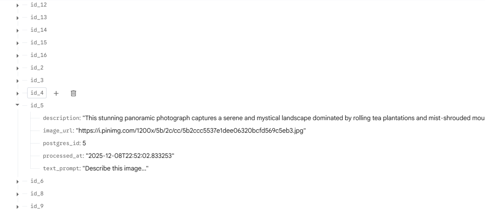

# ☁️ Cloud-Native AI SaaS: Multimodal Object Detection
> **Repository URL:** [https://github.com/5CCSACCA/coursework-Minigo-ovo.git](https://github.com/5CCSACCA/coursework-Minigo-ovo.git)  

[](https://www.docker.com/)
[](https://fastapi.tiangolo.com/)
[](https://streamlit.io/)

## 📖 Project Overview

This project implements a scalable, cloud-native SaaS application designed for **multimodal AI processing**. It leverages an asynchronous microservices architecture to process images and text prompts, utilizing **Google Gemini 2.5 Flash** for high-performance reasoning.

The system is fully containerized using Docker and orchestrated via Docker Compose, adhering to **12-Factor App** principles and **GitFlow** development practices.

### Key Features
* **Multimodal Input:** Accepts Image-only, Text-only, or Mixed (Image + Text) inputs.
* **Asynchronous Processing:** Decoupled Uploader (Producer) and Worker (Consumer) via **RabbitMQ** for high concurrency.
* **Dual-Database Storage:**
    * **PostgreSQL:** Stores structured request metadata and status.
    * **Firebase Realtime Database:** Stores unstructured LLM outputs and JSON results.
* **Observability:** Integrated **Prometheus** and **Grafana** for real-time system monitoring.
* **User Interface:** User-friendly **Streamlit** dashboard for easy interaction and testing.

---

## 🏗️ System Architecture

The system consists of the following isolated services:

1.  **Uploader (API Gateway):** FastAPI service exposing REST endpoints. Accepts user requests and queues them.
2.  **RabbitMQ (Message Broker):** Buffers tasks to prevent system overload during traffic spikes.
3.  **Worker (AI Processor):** Consumes tasks, performs logic, calls Gemini API, and writes to databases.
4.  **Databases:**
    * **PostgreSQL:** Relational storage for transaction logs.
    * **Firebase:** NoSQL storage for flexible result retrieval.
5.  **Monitoring:** Prometheus scrapes metrics (port 8002/8003), visualized by Grafana.
6.  **UI:** Streamlit frontend for user interaction.

---

## 💾 Data Persistence Showcase

The system utilizes a dual-database strategy for optimal performance and flexibility.

### Firebase Realtime Database (NoSQL)
Stores unstructured AI results and JSON outputs. Below is a snapshot of the live database capturing task results:

 

### PostgreSQL (Relational)
Stores structured metadata for every request to ensure auditability.

---

## 🍏 Getting Started (Deployment)

This system is designed to run on a fresh Linux machine with **Docker** and **Docker Compose** installed.

### 1. Prerequisites
* Docker Engine & Docker Compose
* A Google Gemini API Key
* A Firebase Realtime Database URL & Credentials JSON

### 2. Configuration (`.env` file)
This project uses environment variables for security.   
### **Before running**, 
> **📝 Note for Examiners / Markers:**
> To facilitate testing, the required **`.env`** file and the **`firebase-credentials.json`** service account key have been submitted separately via **KEATS** (packaged in a ZIP file).
>
> **Please download and extract these two files into the project root directory (where docker-compose.yml is located)** before running the system. This ensures secure access to the Gemini API and Firebase services without exposing credentials in the codebase.

*(If you are setting this up from scratch, please follow the template below to create your own .env file)*
Please create a file named `.env` in the root directory and populate it with the following variables:

```bash
# Copy and paste this into a new file named .env

# 1. Google Gemini API Key
# You can get a free key here: [https://aistudio.google.com/](https://aistudio.google.com/)
GEMINI_API_KEY=your_gemini_api_key_here

# 2. Firebase Configuration
# URL of your Firebase Realtime Database
FIREBASE_DATABASE_URL=[https://your-project-id-default-rtdb.firebaseio.com](https://your-project-id-default-rtdb.firebaseio.com)
# Path to the service account JSON file inside the container (Mapped via volume)
FIREBASE_CREDENTIALS_FILE=/app/firebase-credentials.json

POSTGRES_DB_URL=postgresql://user:password@db:5432/saas_db
```
**Note: Ensure your firebase-credentials.json file is placed in the root directory.**   

**🔥Important: The system will NOT start if firebase-credentials.json is missing. Please ensure this file exists in the root directory.**

### 3. One-Command Deployment🍻
To build and start the entire stack (API, Worker, DBs, Monitoring, UI):

```bash
sudo docker compose up --build -d
```

### 4. Access Points
* Web UI (Streamlit): http://localhost:8501

* API Docs (Swagger): http://localhost:8000/docs

* Grafana Dashboard: http://localhost:3000 (Login: admin/admin)

* Prometheus: http://localhost:9090

---

## 🧪 Automated Testing
The project includes a robust **Integration Test Suite** that spins up an isolated environment to verify the full pipeline (Submit -> Queue -> Process -> Result -> Cleanup).
To run the automated tests:
```bash
sudo docker compose -f docker-compose.test.yml up --build --abort-on-container-exit
```
* Success Criteria: Look for system_tests exited with code 0 in the output.

---

### ⚠️ Input Requirements
* **Images:** The system currently accepts **publicly accessible Image URLs** (HTTP/HTTPS) only. Local file upload is NOT supported in this version.
* **Text:** Supports any natural language prompts.

---

## 💰 Cost Estimation (Scalability)
Based on the coursework scenario (100 users for API/LLM, scaling to 100,000 for Queue):   
**Formula:**
$$Total Cost = Cost_{API} + Cost_{LLM} + (Cost_{Worker} \times N_{instances}) + Cost_{Queue} + Cost_{Storage}$$
* **API & LLM (Fixed):** Lightweight, stateless services. 1-2 instances sufficient for 100 users.
* **RabbitMQ (Scalable):** Handles 100k users via message buffering. Cost is based on throughput (IOPS).
* **Worker (Variable):** The most expensive component. CPU/GPU intensive.
  * Scaling Strategy: Auto-scale Worker instances based on Queue Length (RabbitMQ metrics).
* **Firebase (F):** Cost scales linearly with data storage size (constant F per GB).
**Sustainability Note:** The asynchronous architecture allows the Worker to sleep or scale down to zero when the queue is empty, significantly reducing energy consumption compared to always-on servers.

---

📂 Project Structure.
```bash
├── docker-compose.yml       # Main production deployment config
├── docker-compose.test.yml  # Isolated testing environment config
├── prometheus.yml           # Monitoring configuration
├── .env                     # Environment variables (Excluded from git)
├── firebase-credentials.json# Firebase key (Excluded from git)
├── uploader_service/        # API Producer code
│   ├── uploader_api.py
│   └── requirements.txt
├── worker_service/          # Worker Consumer code
│   ├── worker_consumer.py
│   └── requirements.txt
└── ui/                      # Streamlit Dashboard
    ├── app.py
    └── requirements.txt
```

---

## 📷 Video script and PPT
They are at the docs folder in this repository.

---

## 🛡️ Security Measures
Secrets Management: API keys and credentials are loaded via .env and Docker volumes, never hardcoded.   
Network Isolation: Database ports (5432) are not exposed to the public internet in production.   
Role Separation: The Uploader cannot execute AI models directly; it only queues tasks, preventing API blocking attacks.
